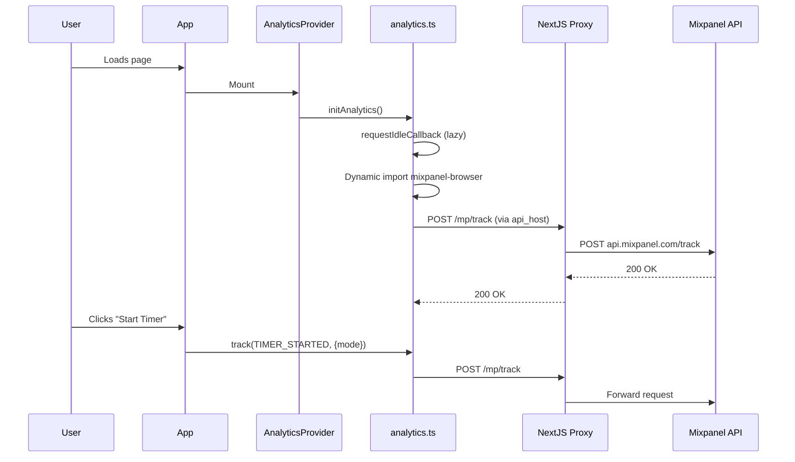

# Analytics (Mixpanel) - LLM Reference

> TL;DR: Mixpanel analytics with lazy loading, proxy for ad-blocker bypass, and autocapture.

## File Structure

```
lib/
├── analytics.ts          # Core module: init, track(), identify()
├── mixpanel-events.ts    # Event constants (single source of truth)

components/
├── analytics-provider.tsx  # Initializes on app mount
├── track-page-view.tsx     # Helper for server components

next.config.ts              # Proxy rewrites (/mp/* → api.mixpanel.com)
.env                        # NEXT_PUBLIC_MIXPANEL_TOKEN
```

## Sequence Diagram



## Events Reference

| Event | Constant | Properties | Trigger Location |
|-------|----------|------------|------------------|
| Timer Started | `TIMER_STARTED` | `{mode: 'pomodoro'\|'shortBreak'\|'longBreak'}` | `app/[locale]/page.tsx` |
| Pomodoro Completed | `POMODORO_COMPLETED` | `{duration_minutes, had_active_task}` | `app/[locale]/page.tsx` |
| Premium Page Viewed | `PREMIUM_PAGE_VIEWED` | `{}` | `app/[locale]/premium/page.tsx` |
| Theme Changed | `THEME_CHANGED` | `{theme: 'light'\|'dark'\|'cute'\|'system'}` | `components/theme-toggle.tsx` |
| Ambient Sound Changed | `AMBIENT_SOUND_CHANGED` | `{sound, label}` | `components/ambient-sounds.tsx` |
| Ambient Sound Toggled | `AMBIENT_SOUND_TOGGLED` | `{isPlaying, sound}` | `components/ambient-sounds.tsx` |
| Language Changed | `LANGUAGE_CHANGED` | `{from_locale, to_locale, to_label}` | `components/language-switcher.tsx` |

## How to Add a New Event

### Step 1: Add constant to `lib/mixpanel-events.ts`

```typescript
export const MixpanelEvents = {
  // ... existing events

  /** Description of what this event tracks */
  NEW_EVENT_NAME: 'New Event Name',
} as const
```

### Step 2: Track the event

```typescript
import { track } from "@/lib/analytics"
import { MixpanelEvents } from "@/lib/mixpanel-events"

// In your component/handler:
track(MixpanelEvents.NEW_EVENT_NAME, {
  property1: 'value1',
  property2: 123,
})
```

### For Server Components

Use the `TrackPageView` helper:

```tsx
import { TrackPageView } from "@/components/track-page-view"
import { MixpanelEvents } from "@/lib/mixpanel-events"

export default function SomePage() {
  return (
    <>
      <TrackPageView event={MixpanelEvents.SOME_PAGE_VIEWED} />
      {/* page content */}
    </>
  )
}
```

## Configuration

### Environment Variable

```bash
NEXT_PUBLIC_MIXPANEL_TOKEN=your_32_char_token
```

### Mixpanel Init Options (in `lib/analytics.ts`)

```typescript
mixpanel.init(token, {
  api_host: '/mp',                    // Proxy (bypass ad blockers)
  debug: NODE_ENV === 'development',  // Console logs in dev
  track_pageview: 'url-with-path',    // SPA route tracking
  persistence: 'localStorage',
  ignore_dnt: false,                  // Respect Do Not Track
  autocapture: {
    pageview: 'url-with-path',
    click: true,                      // Auto-track clicks
    input: false,                     // Don't capture inputs (privacy)
    scroll: false,                    // Skip scroll (noisy)
    submit: true,                     // Track form submits
    capture_text_content: false,      // Don't capture text (privacy)
  },
})
```

### Proxy Rewrites (in `next.config.ts`)

```typescript
rewrites() {
  return [
    { source: '/mp/lib.min.js', destination: 'https://cdn.mxpnl.com/libs/mixpanel-2-latest.min.js' },
    { source: '/mp/decide', destination: 'https://decide.mixpanel.com/decide' },
    { source: '/mp/:slug*', destination: 'https://api.mixpanel.com/:slug*' },
  ]
}
```

## Auto-Enriched Properties

Every `track()` call automatically adds:

```typescript
{
  timestamp: '2024-01-15T10:30:00.000Z',
  path: '/en/premium',
  referrer: 'https://google.com',
}
```

## Key Design Decisions

1. **Lazy loading**: Mixpanel SDK loaded via dynamic import + `requestIdleCallback`
2. **Event queue**: Events tracked before init completes are queued and flushed
3. **Proxy**: All requests go through `/mp/*` to bypass ad blockers
4. **Privacy**: `input: false`, `capture_text_content: false` to not capture sensitive data
5. **Single source of truth**: All event names in `mixpanel-events.ts`

## Quick Commands

```bash
# Check if tracking works (in browser console)
# Look for: [Analytics] Mixpanel initialized with autocapture

# View events in Mixpanel
# Dashboard → Activity → Live View
```
