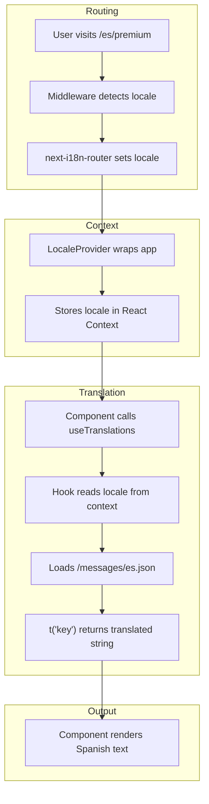

# Internationalization (i18n) Setup

## TL;DR

- **Translation files**: `/messages/{locale}.json` (en, es, de, fr, pt, ja, zh)
- **Hook**: `useTranslations()` from `/hooks/use-translations.ts`
- **Usage**: `const { t } = useTranslations()` then `t('key.subkey')`
- **Routing**: `[locale]` dynamic segment in `/app/[locale]/`

## Architecture Flowchart



## File Structure

```
pomo/
├── messages/
│   ├── en.json          # English (source of truth)
│   ├── es.json          # Spanish
│   ├── de.json          # German
│   ├── fr.json          # French
│   ├── pt.json          # Portuguese
│   ├── ja.json          # Japanese
│   └── zh.json          # Chinese (Simplified)
├── hooks/
│   └── use-translations.ts   # Translation hook
├── components/
│   ├── locale-provider.tsx   # Context provider
│   └── language-switcher.tsx # Flag dropdown
├── app/
│   └── [locale]/             # Locale-based routing
│       ├── layout.tsx        # Wraps with LocaleProvider
│       ├── page.tsx          # Main app
│       ├── premium/
│       └── signin/
├── middleware.ts             # Locale detection/redirect
└── i18nConfig.ts             # Supported locales config
```

## Key Files

| File | Purpose |
|------|---------|
| `i18nConfig.ts` | Defines `locales: ['en', 'es', 'de', 'fr', 'pt']` and `defaultLocale: 'en'` |
| `middleware.ts` | Uses `next-i18n-router` to handle locale redirects |
| `hooks/use-translations.ts` | Exports `useTranslations()` hook |
| `components/locale-provider.tsx` | React context for current locale |
| `messages/en.json` | Master translation file (always update this first) |

## Translation Key Convention

Keys are dot-separated, organized by feature:

```json
{
  "common.back": "Back",
  "common.save": "Save",
  "timer.focus": "Focus",
  "timer.break": "Break",
  "tasks.addTask": "Add Task",
  "settings.title": "Settings"
}
```

## How to Add a New Translation Key

1. **Add to English first** (`messages/en.json`):
   ```json
   "feature.newKey": "English text"
   ```

2. **Add to all other locales** (`es.json`, `de.json`, `fr.json`, `pt.json`, `ja.json`, `zh.json`):
   ```json
   "feature.newKey": "Translated text"
   ```

3. **Use in component**:
   ```tsx
   import { useTranslations } from "@/hooks/use-translations"

   function MyComponent() {
     const { t } = useTranslations()
     return <p>{t('feature.newKey')}</p>
   }
   ```

## How to Add a New Language

1. **Update config** (`i18nConfig.ts`):
   ```ts
   export const i18nConfig = {
     locales: ['en', 'es', 'de', 'fr', 'pt', 'ja'], // Add 'ja'
     defaultLocale: 'en'
   }
   ```

2. **Create translation file** (`messages/ja.json`):
   - Copy `en.json` as starting point
   - Translate all values

3. **Update language switcher** (`components/language-switcher.tsx`):
   ```tsx
   import { US, ES, DE, FR, BR, JP } from 'country-flag-icons/react/3x2'

   const locales = [
     // ... existing
     { code: 'ja', label: '日本語', Flag: JP },
   ]
   ```

4. **Add static params** (`app/[locale]/layout.tsx`):
   ```tsx
   export function generateStaticParams() {
     return [{ locale: 'en' }, { locale: 'es' }, /* ... */ { locale: 'ja' }]
   }
   ```

## Translation with Parameters

For dynamic values, use placeholder syntax:

```json
"achievements.unlocked": "{unlocked}/{total} unlocked"
```

```tsx
t('achievements.unlocked', { unlocked: 5, total: 20 })
// Output: "5/20 unlocked"
```

## Quick Reference for LLMs

When asked to add translations:

1. **Single key**: Add to all 7 JSON files in `/messages/`
2. **New component**: Add `import { useTranslations }`, call `const { t } = useTranslations()`, use `t('key')`
3. **New language**: Update `i18nConfig.ts`, create JSON file, update `language-switcher.tsx`

**Always run `npm run build` after changes to verify.**
