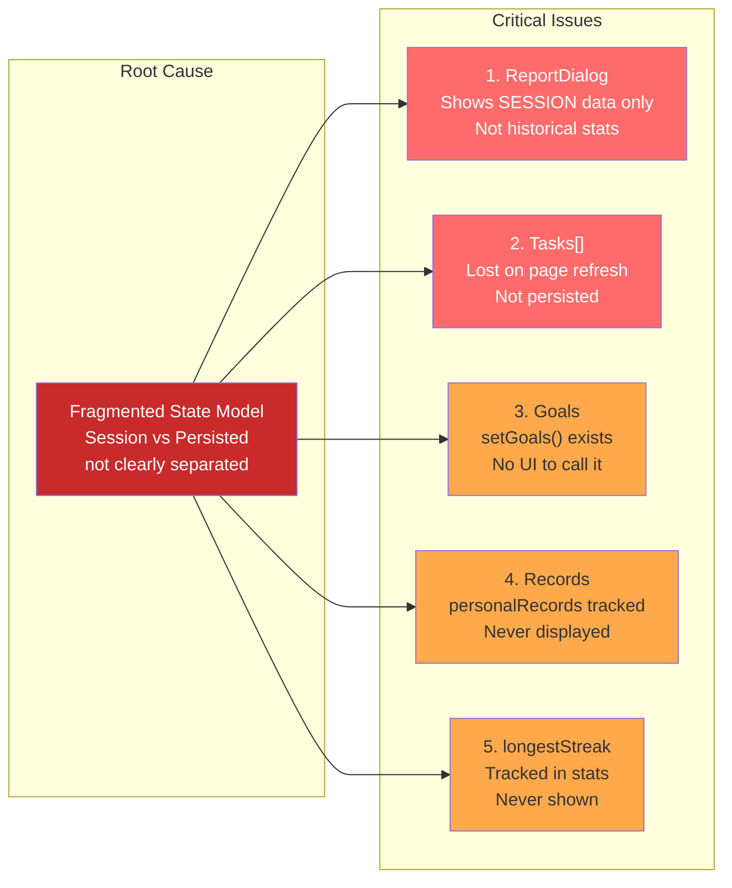
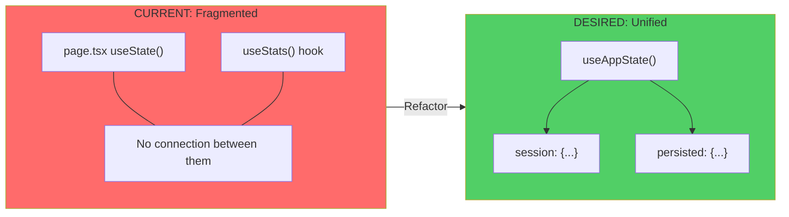
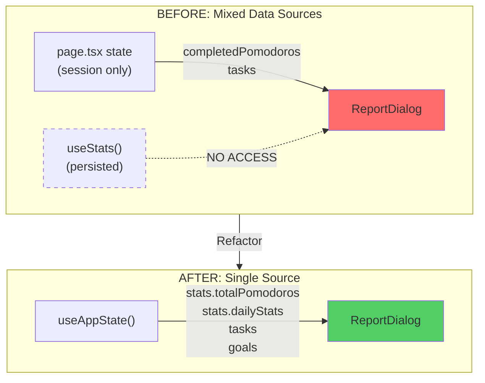
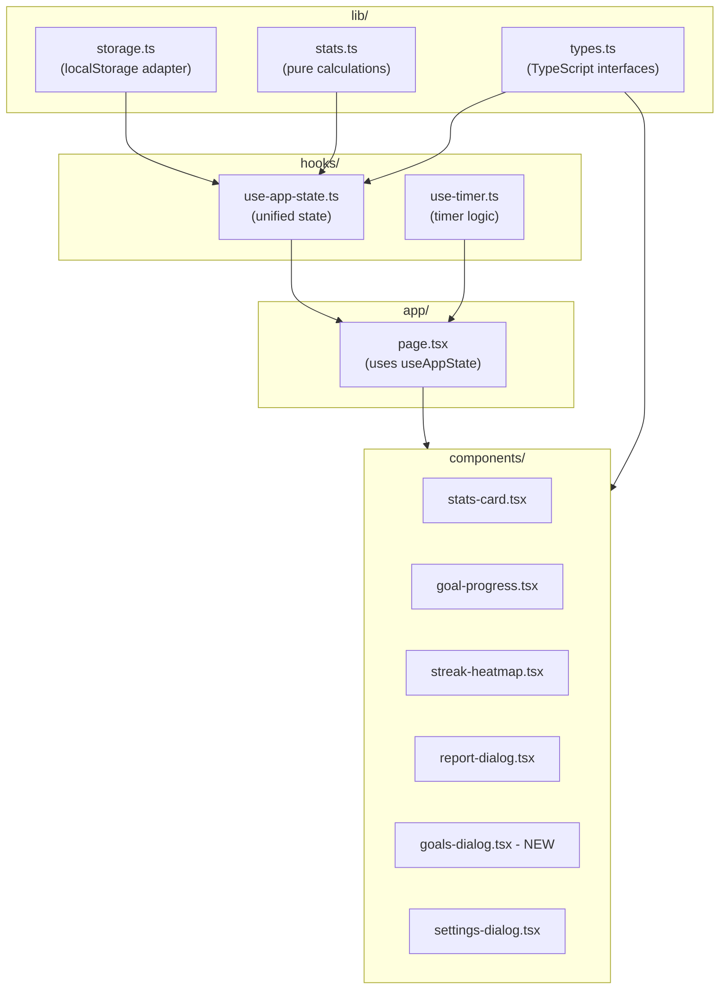

# CodeFocus Architecture Diagrams

## Current Architecture (Problematic)

```mermaid
flowchart TB
    subgraph Browser["Browser Storage"]
        LS[("localStorage<br/>codefocus-stats")]
    end

    subgraph PageState["page.tsx State (SESSION - Lost on Refresh)"]
        SP[completedPomodoros]
        TK[tasks: Task[]]
        ST[settings]
        TM[timer state]
        AT[activeTaskId]
    end

    subgraph UseStats["useStats() Hook"]
        subgraph PersistedStats["Persisted Stats"]
            CS[currentStreak]
            LS2[longestStreak]
            TFM[totalFocusMinutes]
            TP[totalPomodoros]
            DS[dailyStats: DayStats[]]
            LAD[lastActiveDate]
            PR[personalRecords]
            GL[goals]
        end

        subgraph Functions["Functions"]
            RP[recordPomodoro]
            RS[recordSkip]
            GFS[getFocusScore]
            GTS[getTodayStats]
            GHD[getHeatmapData]
            GTH[getTotalHours]
            GLV[getLevel]
            GGP[getGoalProgress]
            SG[setGoals - UNUSED!]
        end
    end

    subgraph Components["UI Components"]
        SC[StatsCard]
        GP[GoalProgress]
        SH[StreakHeatmap]
        RD[ReportDialog]
        TL[TaskList]
        SD[SettingsDialog]
    end

    %% Data Flow
    LS <--> UseStats
    UseStats --> SC
    UseStats --> GP
    UseStats --> SH

    %% PROBLEM: ReportDialog uses session state, not persisted!
    PageState --> RD
    PageState --> TL
    PageState --> SD

    %% Styling for problems
    style RD fill:#ff6b6b,stroke:#c92a2a,color:#fff
    style TK fill:#ff6b6b,stroke:#c92a2a,color:#fff
    style SP fill:#ffa94d,stroke:#e67700
    style SG fill:#ff6b6b,stroke:#c92a2a,color:#fff
    style PR fill:#ffa94d,stroke:#e67700
    style LS2 fill:#ffa94d,stroke:#e67700
```

### Legend
- 🔴 **Red**: Critical issues (data not persisted, broken connections)
- 🟠 **Orange**: Data tracked but never displayed
- Default: Working correctly

---

## Current Data Flow Problems



---

## Desired Architecture

```mermaid
flowchart TB
    subgraph Browser["Browser Storage"]
        LS[("localStorage<br/>codefocus-app")]
    end

    subgraph AppState["useAppState() - Single Source of Truth"]
        subgraph Session["Session State (Ephemeral)"]
            TM2[timer: mode, isRunning, timeLeft]
            SPC[sessionPomodoros]
            ATI[activeTaskId]
        end

        subgraph Persisted["Persisted State (localStorage)"]
            subgraph Stats["stats/"]
                TP2[totalPomodoros]
                TFM2[totalFocusMinutes]
                CS2[currentStreak]
                LS3[longestStreak]
                DS2[dailyStats[]]
                PR2[personalRecords]
            end

            subgraph Tasks["tasks/"]
                TKS[Task[]]
            end

            subgraph Settings["settings/"]
                PMD[pomodoro duration]
                BRK[break durations]
                AUT[auto-start options]
            end

            subgraph Goals["goals/"]
                DG[dailyTarget]
                WG[weeklyTarget]
            end
        end
    end

    subgraph Calculations["Pure Functions (lib/stats.ts)"]
        CF1[calculateStreak]
        CF2[calculateLevel]
        CF3[calculateFocusScore]
        CF4[generateHeatmapData]
        CF5[calculateGoalProgress]
    end

    subgraph Components["UI Components"]
        SC2[StatsCard]
        GP2[GoalProgress]
        SH2[StreakHeatmap]
        RD2[ReportDialog]
        TL2[TaskList]
        SD2[SettingsDialog]
        GD[GoalsDialog - NEW]
    end

    %% Data Flow
    LS <--> Persisted
    AppState --> Components
    Persisted --> Calculations
    Calculations --> Components

    %% All components now have access to everything
    style AppState fill:#51cf66,stroke:#2f9e44
    style Persisted fill:#69db7c,stroke:#2f9e44
    style Session fill:#d3f9d8,stroke:#2f9e44
    style Calculations fill:#a5d8ff,stroke:#1971c2
    style GD fill:#51cf66,stroke:#2f9e44,color:#fff
```

---

## State Structure Comparison



---

## Component Data Access (Before vs After)



---

## File Structure (Proposed)


